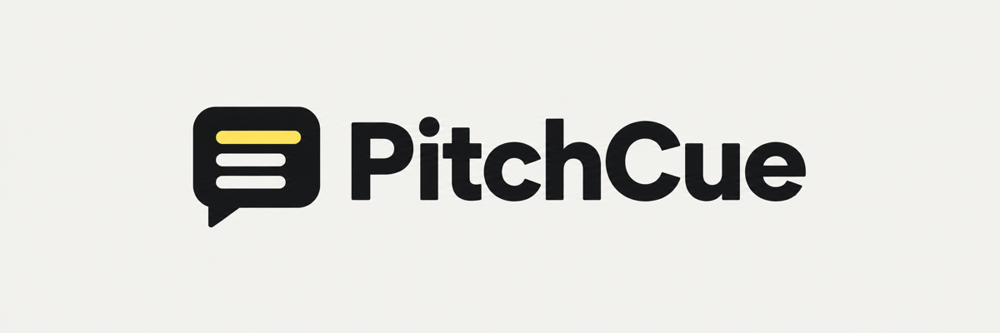
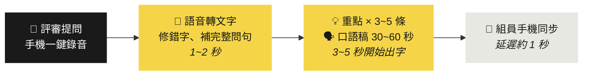

<div align="center">



<br>

### 評審問完的三秒內，手機上就有一份照著唸就好的答案。

黑客松 · Demo Day · 創業競賽 · 專題口試

<br>

[](https://nextjs.org)
[](https://react.dev)
[](https://platform.openai.com)
[](https://upstash.com)
[](https://vercel.com/new/clone?repository-url=https://github.com/wally0302/pitchcue&env=OPENAI_API_KEY,SESSION_SECRET,LOGIN_PASSWORD,ALLOWED_EMAILS)

<br>

[快速開始](#-快速開始) · [它怎麼運作](#-它怎麼運作) · [功能亮點](#-功能亮點) · [上台流程](#-上台流程) · [組員觀看](#-組員即時觀看) · [部署](#-部署到-vercel)

</div>

<br>

---

<br>

## 🎯 為什麼需要 PitchCue

> 簡報可以練一百次，Q&A 不行。

站在台上、燈打在臉上、隊友在旁邊看，評審一開口，腦袋一片空白是常態。更常見的情況是：你明明有數據、明明想過那個風險，只是當下沒接上。

**PitchCue 把你事先準備好的專案文件，變成一個在台上陪你的提詞員。**

評審一開口，手機錄下問題。幾秒後畫面上出現整理好的問題、三到五條回答重點，還有一段可以直接唸出來的口語稿。內容全部來自你自己寫的文件，AI 不會替你捏造數字。

<br>

## ⚡ 它怎麼運作



<table>
<tr>
<td width="33%" valign="top">

**1 · 錄下問題**

按一下開始，評審問完再按一下停止。麥克風出問題可以切成打字。

</td>
<td width="33%" valign="top">

**2 · 看到整理好的問題**

語音辨識參考你的專有名詞表，口語贅字和同音錯字被修掉，多個子問題自動條列。

</td>
<td width="33%" valign="top">

**3 · 照著講**

畫面只顯示最新一題、字放大。口語稿固定結構：先直接回答、給證據、承認限制、說下一步。

</td>
</tr>
</table>

每一題是獨立流程。第一題的答案還在生成，就可以開始錄第二題。

<br>

## ✨ 功能亮點

<table>
<tr>
<td width="50%" valign="top">

### 📚 只根據你的文件回答
把專案簡介、技術架構、商業模式、常見問題放進 `data/`，AI 的回答完全以此為依據。文件裡沒有的數據，它會誠實說「目前沒有實際數據」再給出方向，**不會編**。

</td>
<td width="50%" valign="top">

### 🧠 聽懂評審真正在問什麼
評審常用陳述句或省略主詞提問（「這個成本」「跟 XX 的差別」），整理步驟會補成完整問句。錄音不清楚時會標示信心程度，口語稿第一句先確認再回答。

</td>
</tr>
<tr>
<td width="50%" valign="top">

### 🛡️ 面對質疑有一套
挑戰性的問題會先肯定風險存在，再說你們怎麼想過或打算怎麼處理，不辯解。承認限制之後一定接一個具體的下一步。

</td>
<td width="50%" valign="top">

### 🔗 記得前面問過什麼
評審說「剛剛講的那個」，回答會接續先前的問答，整場 Q&A 是連貫的。

</td>
</tr>
<tr>
<td width="50%" valign="top">

### 📱 一支手機搞定
準備、錄音、閱讀全在同一頁，錄音鈕永遠在最上面，一按就錄。

</td>
<td width="50%" valign="top">

### 👥 組員同步觀看
你負責錄音，組員在自己手機上看同一份答案，延遲約一秒，誰來回答都可以。

</td>
</tr>
<tr>
<td width="50%" valign="top">

### 🔇 零閒置流量
不在使用時整個系統不會打任何 API。觀看頁在背景分頁不輪詢、閒置自動放慢並暫停，講完按「結束本場」就全部停下。

</td>
<td width="50%" valign="top">

### 🔌 斷網有備案
筆電上跑一份本機版本，會場網路不穩就切過去。問答紀錄存在瀏覽器裡，重新整理不會消失。

</td>
</tr>
</table>

<br>

## 🚀 快速開始

需要 Node.js 22 與一把 OpenAI API key。

```bash
git clone https://github.com/wally0302/pitchcue.git
cd pitchcue
cp .env.example .env.local     # 填入 OPENAI_API_KEY 與登入設定（三個變數）
npm install
npm run dev                    # 啟動前會自動把 data/ 合併成知識檔
```

打開 http://localhost:3000，localhost 可以直接用麥克風，不需要 HTTPS。

第一次跑會用 `data/example.md` 的佔位內容，先錄一題感受流程，再放入真實資料。

<br>

## 📂 準備專案資料

> **這一步比任何功能都重要。** `data/` 沒放真實資料時，AI 只會說「我們目前沒有實際數據」。

把資料放進 `data/`，檔案會依檔名排序後全部讀進 AI 的 prompt：

| 檔案 | 寫什麼 | 對應評審在意的 |
|---|---|---|
| `01-專案簡介.md` | 解決什麼問題、給誰用、為什麼是現在 | 問題是不是真的存在 |
| `02-技術架構.md` | 怎麼做的、難在哪 | 做不做得出來、別人能不能複製 |
| `03-商業模式.md` | 怎麼賺錢或怎麼擴散 | 第一批用戶是誰 |
| `04-常見問題.md` | 你自己會怎麼回答評審最可能問的問題 | 全部 |
| `glossary.txt` | 一行一個專有名詞 | 讓語音辨識不會聽錯 |

`data/templates/` 有四份填空範本，複製到 `data/` 根目錄後填寫。**時間不夠就先填 `04-常見問題.md`**，它等於把「你自己會怎麼答」直接餵給 AI。

放入真實資料後請刪掉 `data/example.md`。詳細說明見 [`data/README.md`](data/README.md)。

<br>

## 🎤 上台流程

頁面有兩個狀態：**準備**（還沒有題目）和**閱讀**（有題目之後）。閱讀狀態永遠只顯示最新一題、字放大，方便自己邊看邊講或組員看著講。

| 時機 | 動作 |
|---|---|
| 🟢 上台前 | 打開網頁 → 用 email + 密碼登入 → 按「準備麥克風」（允許權限，綠燈亮）→ 按「暖機」 |
| 🎙️ 評審開始問 | 按「開始錄音」 |
| ⏹️ 評審問完 | 按「停止錄音」→ 卡片出現「轉錄中」→ 1~2 秒後顯示整理好的問題，接著自動生成重點與口語稿 |
| ⏭️ 評審接著問下一題 | 按畫面最上面的「錄下一題」，同一顆鈕變成「停止 0:12」，問完再按一次停止。上一題的答案還在底下 |
| ⚠️ 錄得不清楚 | 一樣直接生成，卡片多一行紅字提醒對一下問題文字。不對就點問題修改後「重新生成」，或按「錄下一題」對著手機複述評審的問題 |
| ⌨️ 麥克風出問題 | 按錄音鈕旁的鍵盤圖示，打字輸入問題，Enter 送出 |
| ✏️ 轉錄結果不對 | 點一下問題文字修改，再按「重新生成」 |
| 🔄 生成方向錯了 | 按「停止」，改問題後「重新生成」 |
| 📜 想看前面的題目 | 直接往下捲，所有舊題都展開列在最新一題下面 |
| 🏁 Q&A 結束 | 右上角 ⋯ →「結束本場」，組員的觀看頁會停止同步；紀錄仍保留在你的手機上 |

<details>
<summary><b>💡 上台技巧（點開看，比任何功能都重要）</b></summary>

<br>

1. **評審問完，先複述再停止錄音。** 對著手機說「評審的問題是⋯」，這段是你近距離的清楚聲音，就算評審那段辨識爛掉也救得回來。複述本身也讓全場知道你聽懂了，還多了幾秒思考時間。
2. **不要等畫面才開口。** 停止錄音後先講一句開場（「這個我們有想過」「關於成本這部分」），三到五秒後重點就出來了，沒有沉默。
3. **手機朝向評審、儘量靠近。** 手機麥克風對三公尺外的人聲衰減很快，這是辨識品質最大的變數。
4. **會場先錄一題試。** 看原始逐字稿還剩多少字。如果連原始稿都零散，整場就用第 1 招，每題都複述。

</details>

<br>

## 👥 組員即時觀看

你用手機錄音與操作，組員在自己的手機開 `/view?code=<ROOM_CODE>` 就能即時看到每題的問題與逐字串流的回答，畫面跟主控頁的閱讀狀態一樣。這是選用功能，需要一個 Upstash Redis 當共用狀態。

<details>
<summary><b>設定方式</b></summary>

<br>

**方法 A：Vercel Marketplace（推薦）**

```bash
vercel link              # 連到你的 Vercel 專案
vercel install upstash   # 建立 Redis，憑證自動注入 Vercel 並拉到 .env.local
```

**方法 B：手動。** 到 https://console.upstash.com 建一個 Redis，把 REST URL 與 TOKEN 填成 `UPSTASH_REDIS_REST_URL` / `UPSTASH_REDIS_REST_TOKEN`（本機 `.env.local` 與 Vercel 環境變數都要）。

然後設定 `ROOM_CODE`（一串不好猜的字）。部署後在主控頁右上角 ⋯ →「組員觀看連結」→「複製」，把連結傳給組員。

沒設定 Redis 時，主控頁標題旁不會有同步圓點（綠＝已同步、紅＝同步失敗），其他功能完全不受影響。

</details>

<details>
<summary><b>流量保護（三層）</b></summary>

<br>

整個系統只有觀看頁會主動打 API，主控頁只在你錄音、送出、內容變動時才送請求。

1. **結束本場**：所有組員的觀看頁會在幾秒內收到並停止輪詢。之後若再錄下一題，房間會自動重新開啟，組員點一下畫面就重新連線。
2. **閒置自動停**：觀看頁分頁在背景就不打；10 分鐘沒新內容就放慢到每 3 秒；30 分鐘就完全停止並顯示「閒置太久已暫停」，點一下畫面才恢復。連線失敗會逐步拉長重試間隔（最多 30 秒）。
3. **資料自動過期**：Redis 裡的房間資料在最後一次寫入後 6 小時自動消失。

</details>

<br>

## ☁️ 部署到 Vercel

[](https://vercel.com/new/clone?repository-url=https://github.com/wally0302/pitchcue&env=OPENAI_API_KEY,SESSION_SECRET,LOGIN_PASSWORD,ALLOWED_EMAILS)

<details>
<summary><b>手動部署步驟</b></summary>

<br>

1. 把這個 repo push 到 GitHub。
2. Vercel → Add New Project → Import 這個 repo（Framework 會自動偵測 Next.js）。
3. Settings → General → Node.js Version 選 **22.x**。
4. Settings → Environment Variables 加入 `OPENAI_API_KEY`、`SESSION_SECRET`、`LOGIN_PASSWORD`、`ALLOWED_EMAILS`（四個都必填；缺登入設定時任何人都無法登入，避免網址外流被刷額度）。
5. Deploy。之後只要 `git push`，Vercel 就會重新 build，並自動重新產生知識檔。

或用 CLI：`vercel` → 依提示操作，再到 dashboard 設定環境變數後 `vercel --prod`。

</details>

<br>

## 🆘 備援

| 狀況 | 做法 |
|---|---|
| 會場網路連不上 Vercel | 筆電上先跑好 `npm run dev`，改用 `http://localhost:3000` |
| 頁面不小心重新整理 | 問答紀錄存在瀏覽器裡不會消失；麥克風要重新授權，「錄下一題」上會標「需授權」，按下去先授權再錄 |

<br>

## ⚙️ 設定

| 變數 | 說明 |
|---|---|
| `OPENAI_API_KEY` | **必填** |
| `SESSION_SECRET` | **必填**，簽登入 cookie 用，`openssl rand -base64 32` 產生 |
| `LOGIN_PASSWORD` | **必填**，登入密碼 |
| `ALLOWED_EMAILS` | **必填**，允許登入的 email，逗號分隔（例：`me@example.com`） |
| `OPENAI_TRANSCRIBE_MODEL` | 預設 `gpt-transcribe` |
| `OPENAI_CLEAN_MODEL` | 預設 `gpt-5.6-luna`（整理問題用） |
| `OPENAI_CHAT_MODEL` | 預設 `gpt-5.6-terra`（生成回答用） |
| `PROMPT_CACHE_KEY` | 預設 `hackathon-qa-v1`，資料大改後可換值 |
| `UPSTASH_REDIS_REST_URL` / `UPSTASH_REDIS_REST_TOKEN` | 選填，啟用組員即時觀看（Vercel Marketplace 注入的 `KV_REST_API_URL` / `KV_REST_API_TOKEN` 也可） |
| `ROOM_CODE` | 選填，觀看頁的房間代碼，預設 `demo` |

<br>

## 🏗️ 技術架構

Next.js 16（App Router）+ React 19 + Tailwind 4，部署在 Vercel。語音辨識、問題整理、回答生成都走 OpenAI API，回答用串流回傳。專案文件在 build 時合併成一個固定的 system prompt，命中 prompt cache 以降低延遲與成本。組員同步用 Upstash Redis 做共享狀態，主控端節流寫入、觀看頁輪詢讀取。

```
data/                        專案資料（你提供）
scripts/build-knowledge.mjs  prebuild：合併 data/ → lib/knowledge.generated.ts
lib/prompts.ts               回答與問題整理的 prompt
proxy.ts                     路由保護：主控頁與 API 沒登入就導向 /login 或回 401
lib/session.ts               HMAC 簽名的登入 cookie（不用 DB）
app/login/                   登入頁（email + 密碼）
app/api/login/ app/api/logout/  發放 / 清除登入 cookie
app/api/transcribe/          錄音 → 文字 → 整理成問題
app/api/answer/              問題 + 歷史 → 串流回答
app/api/room/                組員共享：主控端寫入 / 觀看頁輪詢
app/view/                    組員觀看頁（唯讀）
hooks/useRecorder.ts         全域唯一的錄音器
hooks/useQuestions.ts        每題獨立的 pipeline 與狀態
hooks/useRoomSync.ts         主控端 → Redis 的節流同步
components/                  UI
```

<br>

<div align="center">

**評審的問題不可怕，可怕的是沉默。**

<sub>Made for people who'd rather build than rehearse.</sub>

</div>
